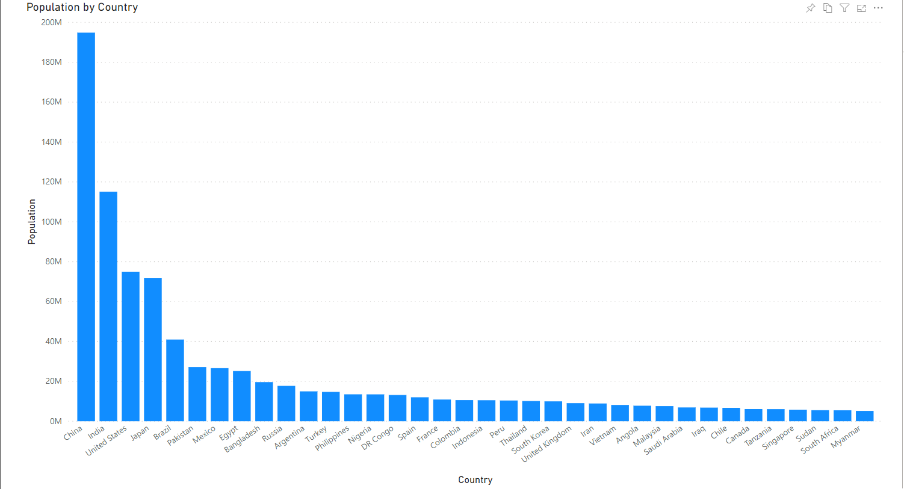
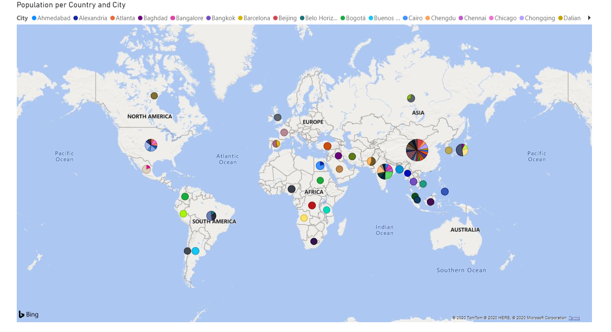
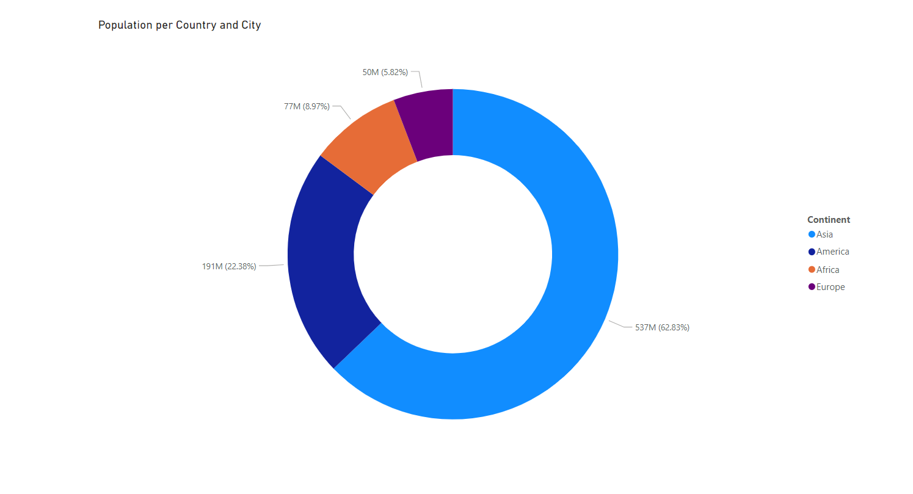

# Web Scraping application
This is a web scrapping application that collects data from a webpage, converts it into a pandas DataFrame, sends it to MySQL Workbench and analyzes it through Microsoft Power BI.

## Web Scraper
The scraper was built using BeautifulSoup library. After creating a BeautifulSoup object, it reads the [page](https://en.wikipedia.org/wiki/List_of_largest_cities), retrieves the data from the table containing the 81 most populated cities in the world and converts it into a pandas DataFrame.

## DataFrame
The pandas DataFrame consists of three columns: City, Country, and Population. It also contains an index.

## MySQL
The connection was established through [sqlalchemy](https://pypi.org/project/SQLAlchemy/), using the [create_engine method](https://docs.sqlalchemy.org/en/13/core/engines.html) using a already built database called "cities". The DataFrame was sent to MySQL through a pandas method called [to_sql](https://pandas.pydata.org/pandas-docs/stable/reference/api/pandas.DataFrame.to_sql.html). 

## Power BI
In Power BI, the dataset received a new column called "Continent" which has the continent the "Country" is at. Data was analzyed through some forms of visualization as follows:

